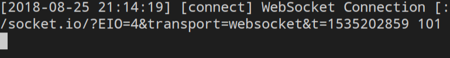
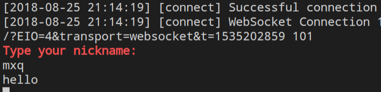
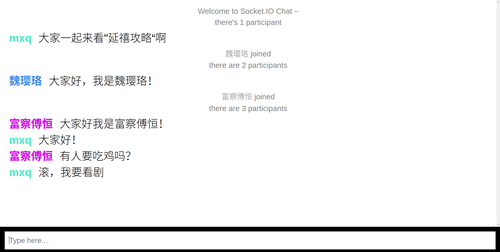
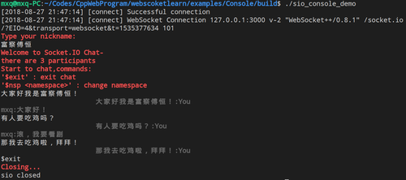

## 基于socket.io-client-cpp学习
原项目地址:
https://github.com/socketio/socket.io-client-cpp

依赖库:

boost

websocketpp

rapidjson

## 实现1：
```
cd echo_server && mkdir build && cd build

cmake ..

make 

运行

./echo_server

```

```
cd examples && cd Console && mkdir build && cd build

cmake ..

make 

运行

./sio_console_demo

```


### 实现２　基于web端和Console 的聊天工具

Step1 开启webchat服务端

```
cd webscoketlearn/examples/chatio
npm install 
cd chat
npm install 
npm start
```
！若报错,要关闭相关端口的进程

Step2 运行Console客户端

```
./sio_console_demo
```

截图:




